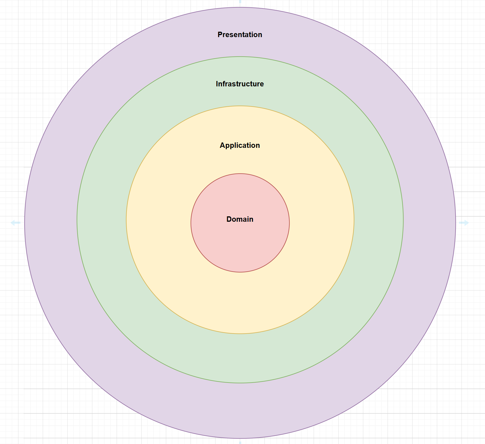


# Stock Price Offering – System Design Overview

## Introduction

This document outlines the architecture and design principles behind the Stock Price Interview assignment. The goal of the system is to provide up-to-date stock prices through both HTTP APIs and WebSocket connections, supporting a range of consumer needs—from low-frequency polling to high-frequency real-time updates.

The application is designed with maintainability, scalability, and testability in mind, following Clean Architecture principles.

---

## Architectural Approach

The system is structured using Clean Architecture, which separates concerns into distinct layers and emphasizes dependency inversion. Each layer focuses on a specific responsibility, making the codebase easier to test and evolve over time.

### Layered Model

```
Core (Entities)
  ↑
Domain
  ↑
Application
  ↑
Infrastructure + Presentation
```

Each outer layer can depend on the inner layer, but not the other way around.



---

## Layer Breakdown

### Core (Entities)

- Contains essential business models and logic
- No external dependencies
- Example: `Stock` entity with price logic

### Domain

- Defines domain contracts like observers and notifiers
- Implements core domain services and rules
- Example: `IStockPriceObserver`, `IStockPriceSubject`

### Application

- Orchestrates business use cases
- Contains DTOs and service interfaces (ports)
- Implements observer handling and coordinates between domain and infrastructure
- Testable with fake implementations of dependencies

### Infrastructure

- Implements external concerns: data access, WebSocket handling, messaging
- Example: `InMemoryStockRepository`, `StockWebSocketHandler`
- Could be extended with Kafka, RabbitMQ, or databases

### Presentation

- Provides HTTP and WebSocket endpoints for client consumption
- Forwards input to application layer and returns results
- Built with ASP.NET Core

---

## Communication Interfaces

### HTTP API

- Exposes stock data via standard REST endpoints
- Includes Swagger documentation for exploration and testing

### WebSocket

- Allows clients to subscribe to stock price updates in real-time
- Uses observer pattern internally to push updates to active connections

---

## Real-Time Update Flow

1. A WebSocket client connects with a stock ID.
2. It subscribes via the `StockPriceNotifier`.
3. When the price changes, the notifier sends the update to all relevant observers.
4. Observers send the data back to clients over the WebSocket.

This design keeps real-time logic decoupled from transport and storage concerns.

---

## Testing

### Unit Tests

- Focus on domain models and use cases
- No external dependencies
- Example: Validating stock price updates and business rules

### Integration Tests

- Integration tests are done through **POSTMAN**
I will provide the demo on monday.

### Architecture/Boundary Tests

- Ensure that layers are not referencing things they shouldn't
- For example, Application must not depend on Infrastructure

---


## Extensibility

The system is designed to support new requirements and integrations:

- Replace `InMemoryStockRepository` with SQL, NoSQL, or external APIs
- Add support for event-driven updates using Kafka or RabbitMQ
- Plug in logging, monitoring, or authentication at appropriate layers


## Getting Started

```bash
dotnet build
dotnet run --project Presentation
dotnet test
```
